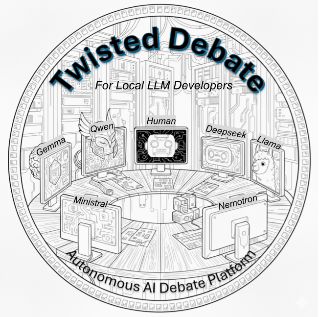
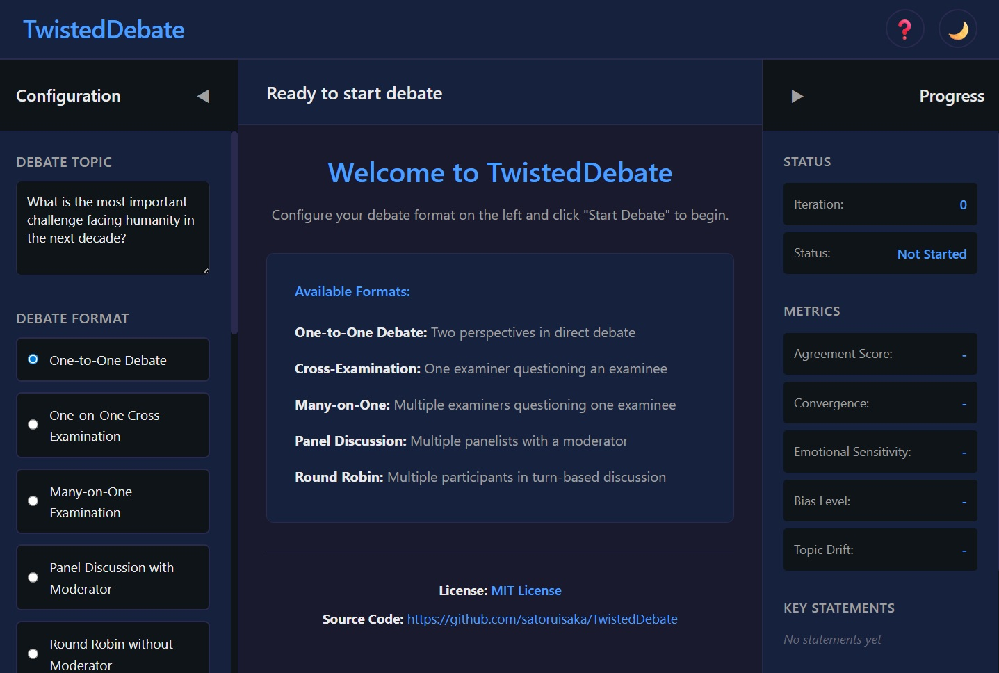
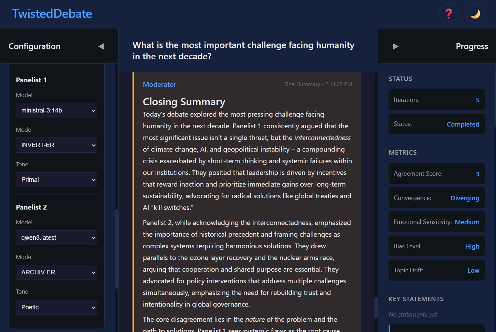

# TwistedDebate: Autonomous AI Debate Platform

A full-stack debate system for iteratively generating and stress-testing ideas via progressive turn-by-turn LLM generation and ***30 dynamic perspective and communication style variations, and 10 debate intensity & creativety levels***.

- Supports five debate formats
- Leverages open-weight large language models (LLMs)
- Exposes wide range of LLM behaviors by MODE, TONE, and GAIN control
- Built for the local LLM community for easy experimentation and custom development with FastAPI/Python backend and JavaScript frontend

---



---

## Summary of Key Features

1. Debate format variations
2. MODE - Debater perspective variations
3. TONE - Debater communication styles
4. GAIN - Debate intensity and cretiveity
5. Realtime debate metrics display
6. Debate transcripts
7. User participation
8. Changing API logic for cloud AI models

## 1. **Debate format** variations

- **One-to-One Debate**: Two perspectives in direct debate
- **Cross-Examination**: One examiner questioning an examinee
- **Many-on-One Examination**: Multiple examiners questioning one examinee  
- **Panel Discussion**: Multiple panelists with a moderator
- **Round Robin**: Multiple participants in turn-based discussion

## 2. **MODE** - Debater perspective variations

- **echo_er**: Amplifies positives, reverberates opportunities
- **invert_er**: Negates signals, flips polarity, points out missing info
- **what_if_er**: Hypothesizes new ideas, explores alternative scenarios
- **so_what_er**: Questions signals, explores implications and consequences
- **cucumb_er**: Cool-headed academic analysis
- **archiv_er**: Brings historical context, prior works, literature

## 3. **TONE** - Debater communication styles

- **neutral**: Clear, standard English
- **technical**: Precise, jargon-heavy, scientific/engineering register
- **primal**: Short, punchy, aggressive
- **poetic**: Lyrical, metaphor-rich, mystical
- **satirical**: Witty, ironic, humorous

## 4. **GAIN** - Debate intensity and cretiveity

- **1~3**: Deterministic, factual
- **4~6**: Balanced, natural
- **7~8**: Creative variation
- **9~10**: Wild, surprising, incoherent

See ***TwistedPair*** (https://github.com/satoruisaka/TwistedPair) for technical details of Mode, Tone, and Gain control.

### Theoretical remarks on TwistedDebate

TwistedDebate is a platform designed to expose the *range of responses* achievable with LLMs. By systematically varying parameters like MODE, TONE, and GAIN, TwistedDebate reveals the inherent ***‘computational perspectives’*** rooted in their training data and the specific context of each prompt.

Think of LLM like an actor playing different roles. The underlying ‘actor’ (the LLM itself) remains consistent, but its ‘performance’ (the generated output) changes dramatically based on the ‘direction’ it receives, such as through adjustments to MODE, TONE, and GAIN.

This understanding is vital for avoiding anthropomorphism; LLMs don't possess fixed personalities or beliefs. Their responses are a product of the prompt, the parameters, and the training data, not inherent consciousness.

### Recommended settings and open weight models

1. For the first time use, pick a model and use the same one for all debate participants, and use MODE="Cucumber" + TONE="Neutral" + GAIN=5 to observe the most belanced LLM behavior.
2. Then with the same model, experiment with different MODE, TONE, and GAIN settings to expose a wide range of LLM behaviors in a single LLM.
3. Then try different models. Each LLM has different behavior characteristcis due to their design objectives, training data, and construction methods. Try experimenting with a variety of models to identify their *instruction following* and *reasoning* characteristics. The variants of models below seem to perform well for debates.
    - gemma
    - mistral / ministral
    - deepseek
    - qwen

## 5. Debate metrics

TwistedDebate analyzes and displays the following debate metrics as the debate progresses:
 - Agreement Score
 - Convergence
 - Emotional Sensitivity
 - Bias Level
 - Topic Drift

## 6. Debate transcripts

Debate transcripts are automatically saved to markdown when complete in /outputs folder. User can click record file link to download it.

## 7. User participation

User can participate as a debater in One-to-One debate and as a moderator in Panel Discussion. All other debate formats are for LLM only.

## 8. Changing API logic for cloud AI models

TwistedDebate is primarily designed for local LLM developers with open weight models, but it can work with cloud AI models by changing the API logic.

Be aware of the associated cost when using cloud AI models due to the potentially large number of tokens being exchanged during a debate.

---



---

## Architecture

### Technology Stack
- **Frontend**: Vanilla JavaScript (ES6+ modules)
- **Styling**: CSS3 with CSS Variables for theming
- **Markdown Rendering**: Marked.js
- **Backend**: FastAPI with Pydantic validation
- **LLM Interface**: Direct Ollama API client
- **Distortion**: TwistedPair-inspired modes (6) and tones (5)
- **Metrics Model**: gemma3:27b for debate analysis

### File Structure

```
TwistedDebate/
├── app/
│   ├── __init__.py         # App initialization
│   ├── config.py           # Configuration, prompts, model settings
│   ├── models.py           # Pydantic data models & enums
│   ├── facilitator.py      # Debate orchestration (legacy)
│   └── server.py           # FastAPI application & endpoints
├── utils/
│   ├── __init__.py
│   └── ollama_client.py    # Direct Ollama API client
├── static/
│   ├── index.html          # Web UI structure (3-column layout)
│   ├── styles.css          # Responsive styling with dark/light themes
│   └── app.js              # Frontend logic (1069 lines: progressive mode, USER input)
├── outputs/                # Saved debate records (markdown)
├── requirements.txt        # Python dependencies
├── .env.example           # Environment template
├── startTwistedDebate_v4.sh  # Startup script
└── README.md              # This file
```

### Prerequisites

1. **Ollama** must be running:
   ```bash
   ollama serve
   ```

2. **Python 3.10+** installed

3. **Required Ollama models**:
   ```bash
   # For debate generation (any model works)
   ollama pull llama2
   # or
   ollama pull qwen3:latest
   
   # For metrics analysis (required)
   ollama pull gemma3:27b
   ```

### Starting the Application

```bash
cd [working directory]
./startTwistedDebate_v4.sh
```

This will:
- Create virtual environment (if needed)
- Install dependencies (FastAPI, Pydantic, Uvicorn, python-dotenv, requests)
- Start the FastAPI backend on port 8004
- Serve the web UI

**Access at:** http://localhost:8004

### Steps to start using TwistedDebate

1. **Enter Debate Topic**: Type your question or topic
2. **Select Format**: Choose from 5 debate formats
3. **Configure Participants**: 
   - Select LLM models (or USER for manual input)
   - Choose distortion mode (echo_er, invert_er, what_if_er, so_what_er, cucumb_er, archiv_er)
   - Select tone variation (analytical, creative, contrarian, diplomatic, provocative)
4. **Set Max Iterations**: Number of rounds (default: 5)
5. **Adjust Gain**: Response creativity slider (1-10, default: 5)
   - 1-3: Low creativity (temp 0.3-0.5)
   - 4-7: Medium creativity (temp 0.7-0.9)
   - 8-10: High creativity (temp 1.1-1.5)
6. **Start Debate**: Click "Start Debate" button
7. **Monitor Progress**: 
   - Watch "X is thinking..." indicators during generation
   - View metrics updated after each turn
   - See key statements extracted in real-time
8. **Participate** (if USER selected): 
   - Input box appears in center panel when it's your turn
   - Enter response and press Ctrl+Enter or click Submit
   - LLM generates responses for other participants
9. **Save Results**: 
   - Debate auto-saves to markdown when complete
   - Click record file link to download

### Page Theme Toggle

- Click moon/sun icon in header
- Preference saved to localStorage
- Instant theme switching

## License

MIT license

## Support

Sorry, no support available.

## Created and last modified

February 16, 2026 by Satoru Isaka
