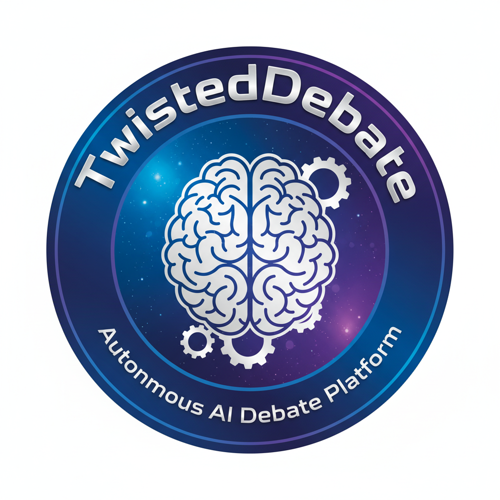

# TwistedDebate: Autonomous AI Debate Platform



A full-stack debate system for iterative idea stress-testing via progressive turn-by-turn LLM generation. 

Designed to benchmark and compare the unique capabilities and characteristics of both local and cloud AI models.

Supports various debate formats and leverages multiple open-weight models with **30+ dynamic perspective and communication style variations and debate intensity & creativety control**.

Built for the local LLM community using a FastAPI/Python backend and JavaScript frontend.

---


---

## Key Features

- **Designed for Local LLMs**: A full-stack platform for unlimited experiments with open weight LLMs. It can also be configured for cloud AI models too.
- **Multiple Models**: Select any available LLMs and have them debate and compare their performances
- **Multiple Debate Formats**: One-to-one debate, One-on-one cross examination, Many-on-one exmination, Panel discussion with moderator, and Round robin discussion
- **Multiple Debater Styles**: Adjust debater perspectives and communication styles by prompt distortion
- **Debate Gain Control**: Adjust debator creativity and intensity by LLM statistical parameters in 1-10 scale
- **USER Participation**: Join debates as a human participant
- **Progressive Display**: Turn-by-turn generation with real-time updates
- **LLM-Based Metrics**: AI analysis of debate quality using gemma3:27b
- **Moderator Synthesis**: Intelligent summarization covering all participants
- **Markdown Export**: Save complete debate records
- **128K Context Window**: Full conversation history for all analysis
- **Thinking Indicators**: Visual feedback during LLM generation

## Debate formats

- **One-on-One Debate**: Two perspectives in direct debate
- **Cross-Examination**: One examiner questioning an examinee
- **Many-on-One Examination**: Multiple examiners questioning one examinee  
- **Panel Discussion**: Multiple panelists with a moderator
- **Round Robin**: Multiple participants in turn-based discussion

---


---

## Architecture

### Technology Stack
- **Frontend**: Vanilla JavaScript (ES6+ modules)
- **Styling**: CSS3 with CSS Variables for theming
- **Markdown Rendering**: Marked.js
- **Backend**: FastAPI with Pydantic validation
- **LLM Interface**: Direct Ollama API client
- **Distortion**: TwistedPair-inspired modes (6) and tones (5)
- **Metrics Model**: gemma3:27b for debate analysis

### File Structure

```
TwistedDebate/
├── app/
│   ├── __init__.py         # App initialization
│   ├── config.py           # Configuration, prompts, model settings
│   ├── models.py           # Pydantic data models & enums
│   ├── facilitator.py      # Debate orchestration (legacy)
│   └── server.py           # FastAPI application & endpoints
├── utils/
│   ├── __init__.py
│   └── ollama_client.py    # Direct Ollama API client
├── static/
│   ├── index.html          # Web UI structure (3-column layout)
│   ├── styles.css          # Responsive styling with dark/light themes
│   └── app.js              # Frontend logic (1069 lines: progressive mode, USER input)
├── outputs/                # Saved debate records (markdown)
├── requirements.txt        # Python dependencies
├── .env.example           # Environment template
├── startTwistedDebate_v4.sh  # Startup script
└── README.md              # This file
```

### Prerequisites

1. **Ollama** must be running:
   ```bash
   ollama serve
   ```

2. **Python 3.10+** installed

3. **Required Ollama models**:
   ```bash
   # For debate generation (any model works)
   ollama pull llama2
   # or
   ollama pull qwen3:latest
   
   # For metrics analysis (required)
   ollama pull gemma3:27b
   ```

### Starting the Application

```bash
cd [working directory]
./startTwistedDebate_v4.sh
```

This will:
- Create virtual environment (if needed)
- Install dependencies (FastAPI, Pydantic, Uvicorn, python-dotenv, requests)
- Start the FastAPI backend on port 8004
- Serve the web UI

**Access at:** http://localhost:8004

### Steps to start using TwistedDebate

1. **Enter Debate Topic**: Type your question or topic
2. **Select Format**: Choose from 5 debate formats
3. **Configure Participants**: 
   - Select LLM models (or USER for manual input)
   - Choose distortion mode (echo_er, invert_er, what_if_er, so_what_er, cucumb_er, archiv_er)
   - Select tone variation (analytical, creative, contrarian, diplomatic, provocative)
4. **Set Max Iterations**: Number of rounds (default: 5)
5. **Adjust Gain**: Response creativity slider (1-10, default: 5)
   - 1-3: Low creativity (temp 0.3-0.5)
   - 4-7: Medium creativity (temp 0.7-0.9)
   - 8-10: High creativity (temp 1.1-1.5)
6. **Start Debate**: Click "Start Debate" button
7. **Monitor Progress**: 
   - Watch "X is thinking..." indicators during generation
   - View metrics updated after each turn
   - See key statements extracted in real-time
8. **Participate** (if USER selected): 
   - Input box appears in center panel when it's your turn
   - Enter response and press Ctrl+Enter or click Submit
   - LLM generates responses for other participants
9. **Save Results**: 
   - Debate auto-saves to markdown when complete
   - Click record file link to download

### Page Theme Toggle

- Click moon/sun icon in header
- Preference saved to localStorage
- Instant theme switching

## License

MIT license

## Created and last modified

February 16, 2026 by Satoru Isaka

## Support

Sorry, no support available.